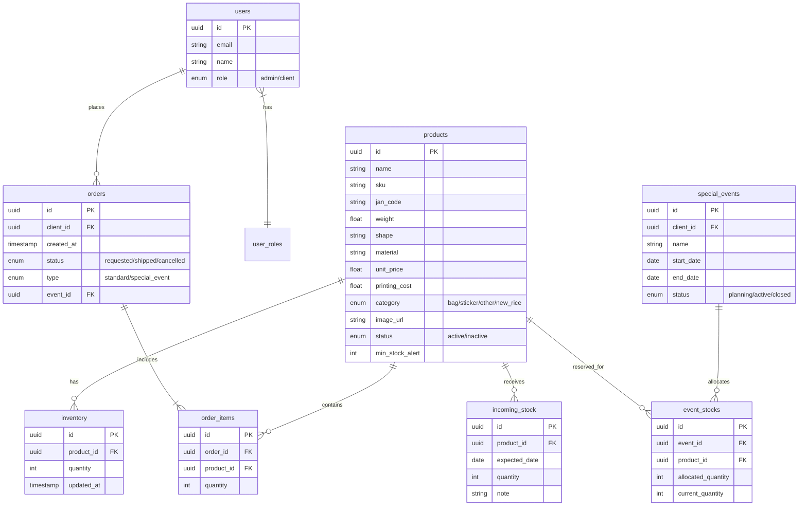

# 在庫管理システム - 実装計画

## 概要

米袋・シール関連商品の在庫管理システムを構築します。
- **利用者**: 社内スタッフ + クライアント（取引先）
- **商品数**: 数百件（今後増加予定）
- **デバイス**: PC + スマートフォン

---

## 技術スタック

| 技術 | 用途 |
|------|------|
| **Next.js 16** | フロントエンド + API Routes |
| **Supabase** | クラウドDB + 認証 |
| **NextAuth.js** | 認証統合 |
| **TailwindCSS 4** | スタイリング |
| **shadcn/ui** | UIコンポーネント |
| **Vercel** | デプロイ |

---

## データベース設計（Supabase）

### テーブル構成



---

## Proposed Changes

### フェーズ1: 基盤構築（まず最初に実施）

---

#### [NEW] `src/lib/supabase.ts`
Supabaseクライアントの初期化

#### [NEW] `.env.local`
Supabase接続情報（環境変数）

#### [NEW] `src/app/api/auth/[...nextauth]/route.ts`
NextAuth.js + Supabase認証

#### [NEW] `src/app/login/page.tsx`
ログインページ

#### [NEW] `src/middleware.ts`
認証ミドルウェア（未ログイン時リダイレクト）

---

### フェーズ2: コア機能

---

#### [NEW] `src/app/api/products/route.ts`
商品マスタCRUD API

#### [NEW] `src/app/api/inventory/route.ts`
在庫取得・更新API

#### [NEW] `src/app/api/inventory/incoming/route.ts`
入庫処理API

#### [NEW] `src/app/api/inventory/outgoing/route.ts`
出庫処理API

#### [MODIFY] `src/app/(dashboard)/inventory/page.tsx`
モックデータ → Supabase APIへ切り替え

#### [NEW] `src/components/inventory/StockUpdateModal.tsx`
入出庫モーダル（スマホ対応）

---

### フェーズ3: 追加機能

---

#### [MODIFY] `src/app/(dashboard)/orders/page.tsx`
発注一覧をDB連携

#### [MODIFY] `src/app/(dashboard)/events/page.tsx`
特売イベントをDB連携

#### [NEW] `src/app/api/reports/route.ts`
レポート生成API

#### [NEW] `src/components/inventory/StockAlertBadge.tsx`
在庫アラート表示コンポーネント

---

## User Review Required

> [!IMPORTANT]
> **Supabaseプロジェクトの作成が必要です**
> 
> 実装を開始する前に、以下を準備してください：
> 1. [Supabase](https://supabase.com) でプロジェクトを作成
> 2. Project URL と anon key を取得
> 3. 無料プランで十分対応可能です

> [!WARNING]
> **認証方式の確認**
> 
> クライアント（取引先）のログイン方法について確認が必要です：
> - メール/パスワード認証？
> - 招待リンク方式？
> - 管理者がアカウント作成？

---

## Verification Plan

### 開発中の確認

1. **ローカル動作確認**
   ```bash
   npm run dev
   # http://localhost:3000 で動作確認
   ```

2. **API動作確認**
   - ブラウザのDevToolsでAPIレスポンスを確認
   - Supabaseダッシュボードでデータ反映を確認

### 手動テスト（各フェーズ完了時）

| テスト項目 | 確認方法 |
|-----------|----------|
| ログイン | メール/パスワードでログイン可能 |
| 在庫一覧 | 商品リストがDBから取得される |
| 入庫処理 | 数量入力 → 在庫数が増加 |
| 出庫処理 | 数量入力 → 在庫数が減少 |
| スマホ表示 | Chrome DevToolsのモバイルビューで確認 |

### 自動テスト（後続で追加）

- Jest + React Testing Libraryでコンポーネントテスト
- Playwright/Cypressでe2eテスト（必要に応じて）

---

## 実装の進め方

1. **フェーズ1を先に完了** → 認証・DB接続が全機能の基盤
2. **段階的にAPIを追加** → 動作確認しながら進める
3. **スマホ対応は並行して** → 各機能実装時にレスポンシブ確認

---

## 質問事項

実装を開始する前に確認させてください：

1. **Supabaseは使用経験ありますか？** プロジェクト作成をサポートしましょうか？
2. **クライアント用アカウントの作成方法** はどうしますか？（管理者が作成 / 招待メール など）
3. **既存のExcelデータ** を最初にインポートする必要がありますか？
